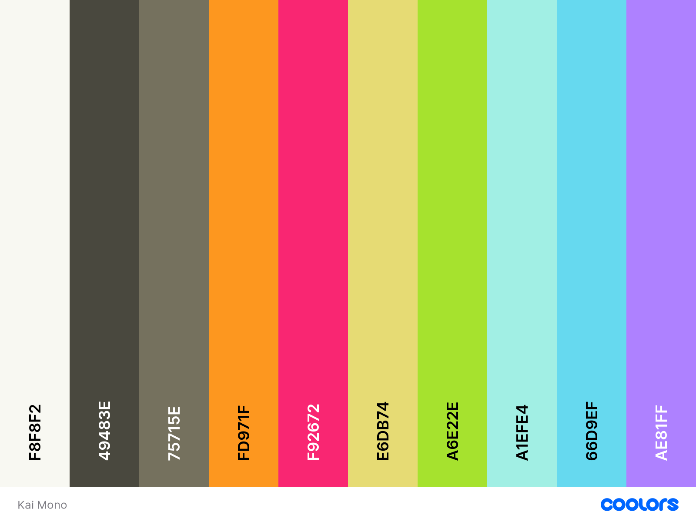

# Kai Mono VSCode Theme



A simple monokai theme for VSCode<br>
View the color palette [here](https://coolors.co/f8f8f2-49483e-75715e-fd971f-f92672-e6db74-a6e22e-a1efe4-66d9ef-ae81ff)

## Getting Started
To install this theme, clone this repository into your VSCode extensions folder. This can be done by running the following command in your terminal:

```bash
git clone https://github.com/jclarkdev/kai-mono.git ~/.vscode/extensions/kai-mono
```

In  case you want to modify this theme for your own, it's recommended to fork this repository first and then clone your fork into your VSCode extensions folder.

## Contributing
If you would like to contribute to this project, please open an issue or submit a pull request.